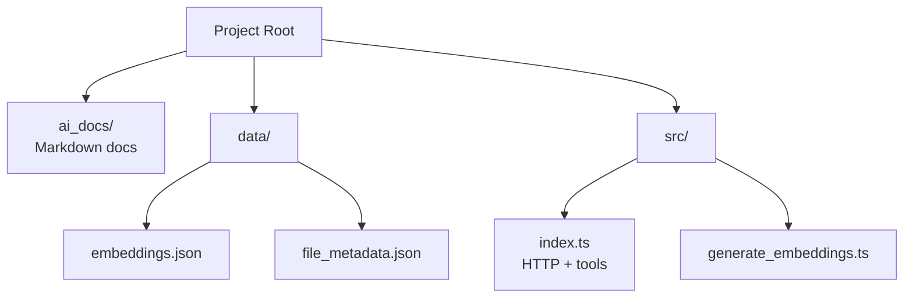

# Contexto Documentation

This document provides an overview of the Contexto server, its structure, and how to interact with it.

## Embeddings for Document Search

The core of the documentation search functionality relies on **embeddings**.

1. **Embed** every markdown file → vector store (embeddings) (`data/embeddings.json`).
2. **Query** → converted to the same vector space.
3. **Search** cosine similarity between the query and the embeddings → return top matches.

## Folder Map

## Contexto Server Tools

The Contexto server exposes the following tools for interaction:

### `search-docs`

- **Purpose:** To find the most relevant documentation based on a natural language query.
- **Input:** A `query` string.
- **Output:** A JSON object containing a ranked list of the most relevant documents. Each object in the list includes the `path` to the document and a similarity `score`.

### `read-doc`

- **Purpose:** To read the content of a specific documentation file.
- **Input:** The `filePath` of the document to be read. This path is obtained from the results of the `search-docs` tool.
- **Output:** The full content of the specified documentation file as a string.

### `init`

- **Purpose:** To set up the necessary configuration files for both the AI and the developer environment.
- **Input:** None.
- **Output:** Confirmation messages indicating the successful creation of the rule files.
- **Details:** This tool creates:
  1.  A rule file at `.cursor/rules/always-mcp-doc-search.mdc` to instruct Cursor to always consult this documentation first.
  2.  A `GEMINI.md` file with a similar rule for Gemini.

### `generate-index`

- **Purpose:** To fully synchronize the search index with the `ai_docs` folder. It intelligently handles additions, modifications, and deletions to ensure the search results are always perfectly up-to-date.
- **Input:** None.
- **Output:** A confirmation message detailing how many documents were added, modified, and/or removed from the index.

### `create-doc`

- **Purpose:** To create a new documentation file in the `ai_docs` folder.
- **Input:** A `fileName` string specifying the file to create (with or without the `.md` extension).
- **Output:** A confirmation message indicating the file has been created.

### `delete-doc`

- **Purpose:** Deletes a documentation file from the `ai_docs` folder and reindexes the embeddings so it is not accessible through other tools.
- **Input:** A `fileName` string specifying the file to delete (with or without the `.md` extension).
- **Output:** A confirmation message indicating the file has been deleted and the index has been updated.
